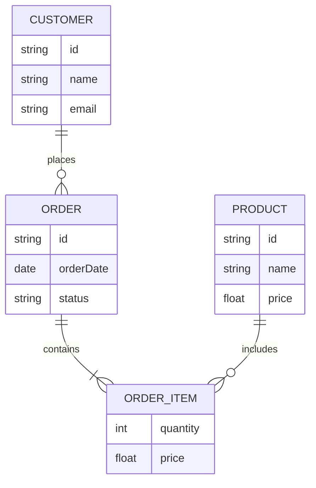
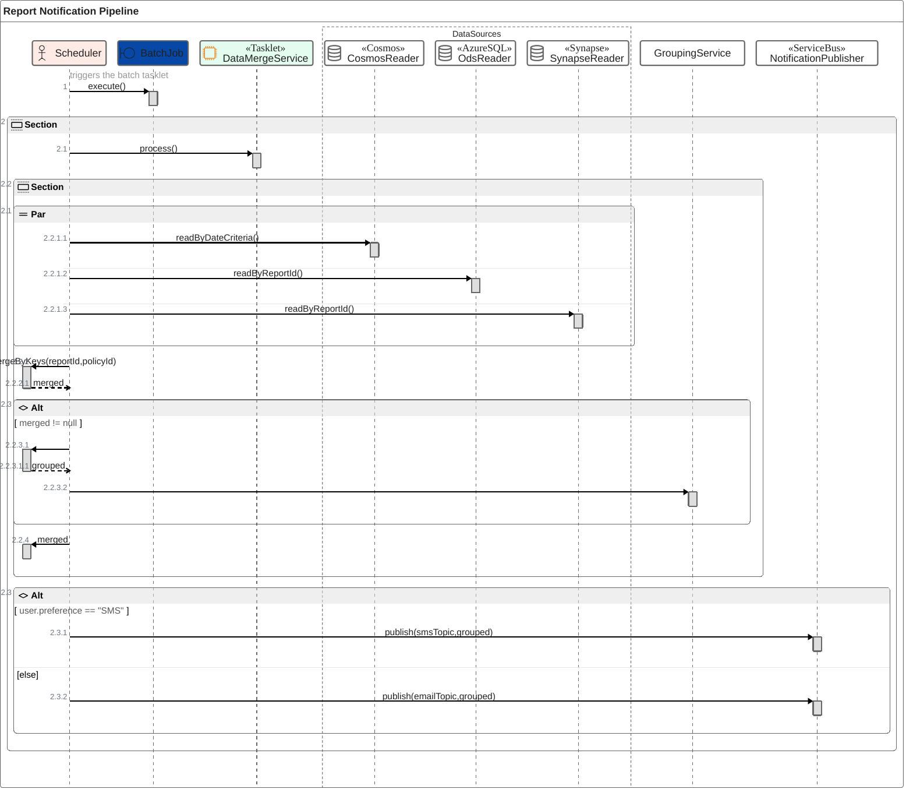

# Objective Create an rest api using Spring boot
## Spring boot project Strcture

```mermaid
treeView-beta
            restDemo/
                     src/
                         main/
                              java/
                                   com/
                                       cc/
                              test/
                                   com/
                                       cc/
                .gitignore
                pom.xml
                README.md
```
## state diagrm

```mermaid
erDiagram
    CUSTOMER ||--o{ ORDER : places
    ORDER ||--|{ ORDER_ITEM : contains
    PRODUCT ||--o{ ORDER_ITEM : includes
    CUSTOMER {
        string id
        string name
        string email
    }
    ORDER {
        string id
        date orderDate
        string status
    }
    PRODUCT {
        string id
        string name
        float price
    }
    ORDER_ITEM {
        int quantity
        float price
    }
```

```mermaid
zenuml
    title Report Notification Pipeline
    @Actor Scheduler #FFEBE6
    @Boundary BatchJob #0747A6
    @EC2 <<Tasklet>> DataMergeService #E3FCEF
    group DataSources {
      @Database <<Cosmos>> CosmosReader
      @Database <<AzureSQL>> OdsReader
      @Database <<Synapse>> SynapseReader
    }
    @Service GroupingService
    @Queue <<ServiceBus>> NotificationPublisher

    @Starter(Scheduler)
    // triggers the batch tasklet
    BatchJob.execute() {
      DataMergeService.process() {
        par {
          CosmosReader.readByDateCriteria()
          OdsReader.readByReportId()
          SynapseReader.readByReportId()
        }
        merged = mergeByKeys(reportId, policyId)
        if(merged != null) {
          grouped = GroupingService.group(merged)
          if(user.preference == "SMS") {
            NotificationPublisher.publish(smsTopic, grouped)
          } else {
            NotificationPublisher.publish(emailTopic, grouped)
          }
        }
      }
    }
```
